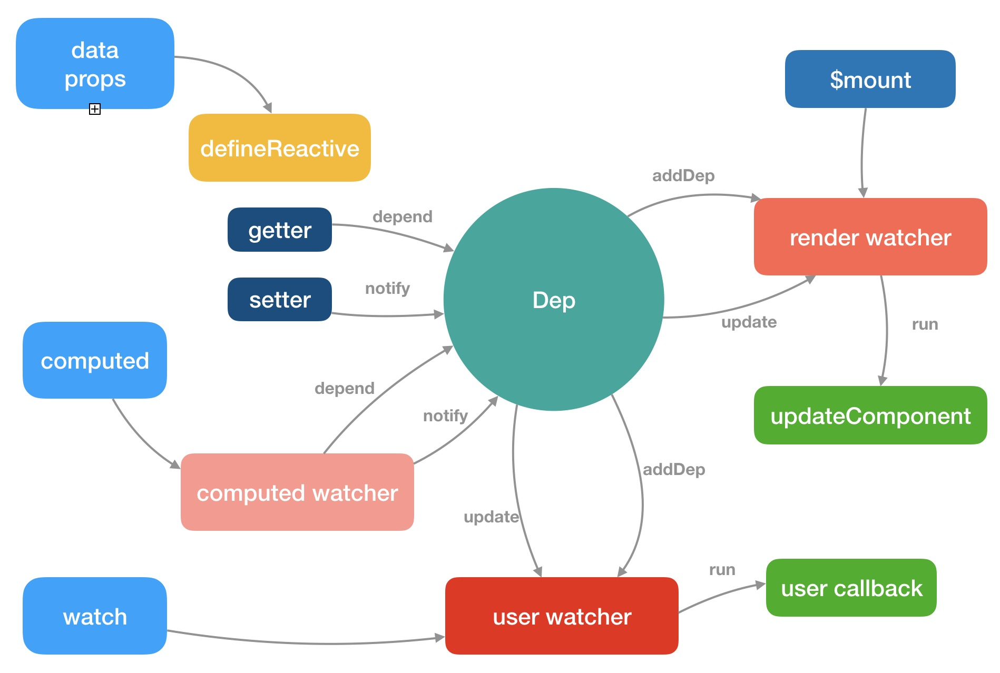

### Vue设计图

- **监听者(Observer)：** 这个模块的主要功能是给data中的数据增加getter和setter，以及往观察者列表中增加观察者，当数据变动时去通知观察者列表。
- **观察者列表(Dep)：** 这个模块的主要功能是维护一个熟悉的观察者列表，当这个属性触发getter时，将观察者添加到列表中，当属性触发setter造成数据变化时，通知所有观察者
- **观察者(Watcher)：** 这个模块的主要功能是对数据进行观察，一旦收到数据变化的通知就去改变视图。

### 初始化示意图
> 初始化页面，获取data属性的同时，将订阅者watcher传给Dep中，当data中的属性有更新的时候，触发notify方法通知对应的watcher进行更新，更新后重新渲染页面，继续添加依赖


初始化过程中（new Vue）主要执行两个步骤：
1、compile：对于给定的目标元素进行解析，识别出所有绑定在元素上的指令
2、link：建立指令与对应数据的绑定关系，并以数据的初始值进行渲染


;

### 初始化源码
```js
function Vue(options) {
    if (process.env.NODE_ENV !== 'production' && !(this instanceof Vue)) {
        console.warn('Vue is a constructor and should be called with the "new" keyword');
    }
    this._init(options);
}
initMixin(Vue);
stateMixin(Vue);
eventsMixin(Vue);
lifecycleMixin(Vue);
renderMixin(Vue);

/**************************分割线***************************/

// _init方法如下定义
let uid = 0;
Vue.prototype._init = function(options) {
    const vm = this;
    vm._uid = uid++;    // 每个VM实例都有一个uid
    vm._isVue = true;
    if (options && options.isComponent) {
        initInternalComponent(vm, options);
    } else {
        vm.$options = mergeOptions(
            resolveConstructorOptions(vm.constructor),
            options || {},
            vm
        )
    }
    if (process.env.NODE_ENV !== 'production') {
        initProxy(vm);
    } else {
        vm._renderProxy = vm;
    }

    // 执行一系列初始化操作，核心代码
    vm._self = vm;
    initLifeCycle(vm);
    initEvent(vm);
    initRender(vm);
    callHook(vm, 'beforeCreate');
    initInjections(vm);
    initState(vm);
    initProvide(vm);
    callHook(vm, 'created');

    // 执行挂载操作
    if (vm.$options.el) {
        vm.$mount(vm.$options.el);
    }
}
```

### 参考资料
1、[简单易懂的Vue数据绑定源码解读](https://juejin.im/post/5abe5822f265da2373149276)
