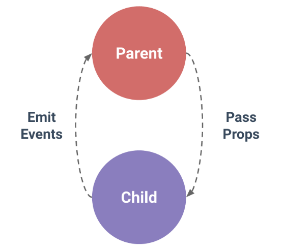

### 前言
组件通讯在开发过程中是一个核心问题，对于复杂的系统，我们可以通过Vuex来实现，但是如果是简单的示例中引入Vuex则有点不划算了。

### 父子组件通讯方式
> 在Vue中，父子组件的关系可以总结为 **prop向下传递，事件向上传递**。父组件通过prop给子组件下发数据，子组件通过事件给父组件发送消息。
> 

### 非父子组件通讯方式
有时候，非父子关系的两个组件间也需要进行通信，在简单的场景下，可以使用一个空的Vue实例作为事件总线

#### 自定义一个事件总线
初始化一个Vue实例，并将其输出
```js
// EventBus.js
import Vue from 'vue';
export default new Vue(); 
```

#### 通过EventBus发送数据消息
在组件中引入EventBus，通过this.$emit来触发事件，并发送数据
```js
// 组件A中
import EventBus from './EventBus'; // 引入EventBus总线

EventBus.$emit("doSomething", params); // 触发事件，发送数据
```

#### 通过EventBus接收数据消息
消息一旦通过this.$emit发生出去，所有注册了该事件的组件都能够监听接收到消息。
```js
// 组件B中
import EventBus from './EventBus'; // 引入EventBus总线

EventBus.$on("doSomething", (params) => {   // 监听事件，接收数据
    console.log(params);
});
```

### vue-router中的使用
如果项目中使用到了vue-router，并且需要跨组件传递参数的情形，最好还是用vuex，如果还是使用EventBus的话，需要注意以下: 在A组件的destroy钩子中去触发传递消息，并在B组件中的created钩子去接收消息
```js
// A组件
destroy() {
    EventBus.("doSomething", params);
}

// B组件
created() {
    EventBus.$on('doSomething', (params) => {
        console.log(params);
    })
}
```
为什么需要这么做呢？
**因为vue-router切换组件时，先加载新的组件，等新的组件渲染好但是还没挂载前，销毁旧组件再挂载新组件。**
切换时新旧组件的生命周期钩子执行情况如下：
```
新组件：beforeCreate
新组件：created
新组件：beforeMount
旧组件：beforeDestroy
旧组件：destroy
新组件：mounted
```
这样就可以知道，新组件只要在旧组件beforeDestroy前，$on事件就可以成功的接收的到数据了

### 总结
1、父组件给子组件传递数据可以通过props属性进行
2、子组件给父组件或非父组件间进行数据传递可以使用事件总线来实现。具体做法是先定义一个事件总线实例，并在需要用到的组件中引入该实例，然后通过emit和on来触发和接收消息。
3、在使用了vue-router的项目中，需要在A组件的destroy钩子中去触发传递消息，并在B组件中的created钩子去接收消息

### 参考
[Vue自定义组件事件传递：EventBus部分](https://juejin.im/post/5b2f2402f265da59b37e7ab1)
[vue2 eventbus 求解惑](https://segmentfault.com/q/1010000007879907)
